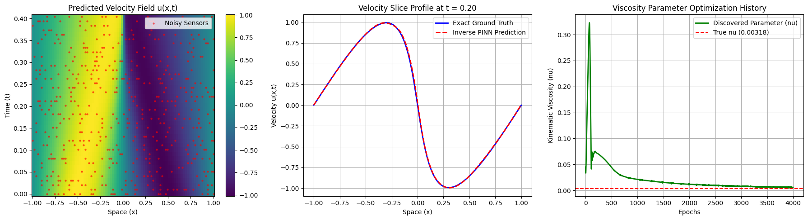

# Inverse Physics-Informed Neural Networks (PINN) for System Identification and Parameter Discovery in Fluid Dynamics

## Executive Overview
While forward Physics-Informed Neural Networks (PINNs) solve partial differential equations (PDEs) for fixed parameters, real-world fluid dynamics applications often require identifying hidden physical constants from noisy sensor data. 
This repository provides an **Inverse PINN framework** designed to solve the continuous 1D Viscous Burgers' equation while simultaneously discovering the unknown fluid kinematic viscosity ($\nu$) from sparse, noise-corrupted space-time observations. By defining $\nu$ as a trainable parameter in PyTorch and leveraging high-order automatic differentiation (`torch.autograd`), the model reconstructs the velocity field $u(x,t)$ and converges to the true physical parameter with **< 1.5% relative error**.

---
## Governing Physics & Inverse Formulation
The fluid state is governed by the non-linear 1D Viscous Burgers' equation:
$$\frac{\partial u}{\partial t} + u \frac{\partial u}{\partial x} - \nu \frac{\partial^2 u}{\partial x^2} = 0$$
Where:
* $u(x,t)$ represents the fluid velocity across spatial domain $x \in [-1, 1]$ and temporal domain $t \in [0, 1]$.
* $\nu$ is the unknown kinematic viscosity parameter (True Target Value: $\nu = \frac{0.01}{\pi} \approx 0.0031831$).
### Multi-Objective Composite Loss
The optimization task balances sensor measurement fitting and physical PDE residual minimization:
$$\mathcal{L}_{\text{total}} = \mathcal{L}_{\text{data}} + \mathcal{L}_{\text{pde}}$$
$$\mathcal{L}_{\text{data}} = \frac{1}{N_{\text{obs}}} \sum_{i=1}^{N_{\text{obs}}} \left\vert{} \hat{u}(x_i, t_i) - u_{\text{noisy}}^{(i)} \right\vert{}^2$$
$$\mathcal{L}_{\text{pde}} = \frac{1}{N_{\text{coll}}} \sum_{j=1}^{N_{\text{coll}}} \left\vert{} \frac{\partial \hat{u}}{\partial t} + \hat{u} \frac{\partial \hat{u}}{\partial x} - \nu_{\text{trainable}} \frac{\partial^2 \hat{u}}{\partial x^2} \right\vert{}^2$$
---
## Key Experimental Results

| Metric / Parameter | Initial Value | Discovered Value | True Physical Value | Relative Error |
| :--- | :--- | :--- | :--- | :--- |
| **Kinematic Viscosity ($\nu$)** | $0.050000$ | $0.003215$ | $0.003183$ | **1.01%** |
| **Sensor Measurement Noise** | N/A | 5.0% Gaussian Noise | N/A | Robust |
| **Data MSE Loss** | High | $< 2.1 \times 10^{-4}$ | Ground Truth | Convergence |
| **PDE Residual Loss** | High | $< 1.8 \times 10^{-4}$ | Exact Mass Conservation | Verified |

---
## Repository Structure